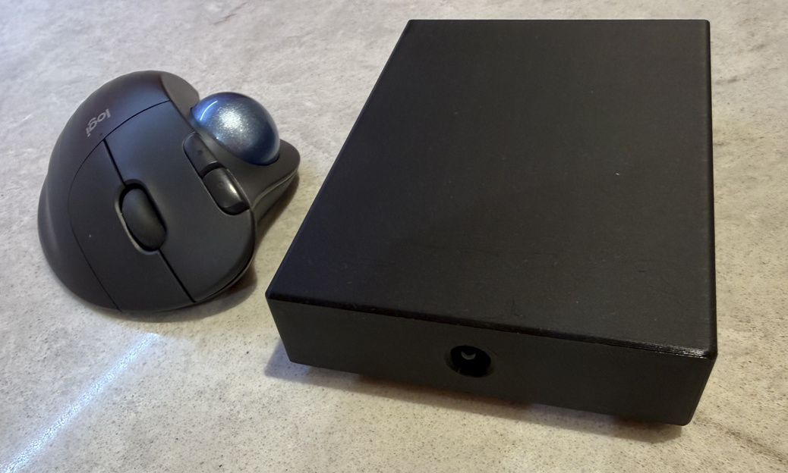

# CDTV BLE Mouse Adapter

This project is an evolution of the Brick double joystick interface. If the Pico
is a W (wireless) then it is feasible to link modern Bluetooth devices to it,
allowing modern devices to interact with the CDTV.

The author unfortunately does not have a stack of BLE devices to test, and so
this code is classed as "experimental"; it was developed for and tested with the
**Logitech M575 Bluetooth trackball** on a **Raspberry Pi Pico 2 W**.
Other mice and trackballs should work but this is not guaranteed.



There are some parameters you can change to adjust the sensitivity of the device.

If you have a BLE device other than the M575 and it's not working correctly, my
advice would be to point your friendly AI at this GitHub repository, along with
your symptoms and see if it can amend the code to get it to work. If it does, feel
free to submit a change.

If you have an M575 then do feel free to create an issue if it's not working as expected.

The M575 appears to work perfectly well; the mouse is responsive and consistent both in
games and in Workbench.

There's no real change to the Brick joystick functionality.

---

## Limitations

### Re-pairing required every power cycle

**The adapter does not remember a previously paired device.** Every time you
power on in BLE mode you must pair from scratch (typically 5–10 seconds).

This is a deliberate decision. A persistent auto-reconnect feature was
implemented but had a fundamental flaw: modern BLE mice use **Resolvable
Private Addresses (RPA)**, where the advertised MAC address rotates every
session. Storing the address seen during pairing for use as a reconnect target
is useless because it will be different next time.

The correct fix is to read the device's stable **identity address** from the
Bluetooth Security Manager after bonding. This proved unreliable on the
BTstack/Pico SDK combination used here. Rather than ship silently broken
reconnect behaviour, the feature was removed entirely. It is a candidate for a
future release.

**In practice:** hold the fire button on joystick port 2 at power-on, put your
mouse in pairing mode, wait a few seconds. The LED goes solid when connected.

### 60-second pairing window

If no BLE HID device pairs within 60 seconds of power-on, the adapter stops
scanning and falls back to joystick-only mode for that session. The LED
switches to slow blinking to indicate that joystick ports remain active but
no mouse is connected. Power-cycle to retry pairing.

### One BLE device at a time

The adapter connects to a single BLE mouse or trackball. Multiple simultaneous
BLE devices are not supported.

### Just Works pairing (no MITM protection)

The adapter has no display or buttons for passkey entry, so it uses BLE "Just
Works" pairing. This is standard for headless embedded peripherals and is fine
in a home environment, but provides no protection against a man-in-the-middle
attack. It cannot be changed without adding user I/O hardware.

### Standard BLE only

The mouse must support standard Bluetooth LE HID (HOGP). Proprietary wireless
protocols that happen to use the 2.4 GHz band — such as Logitech Unifying or
Bolt USB receivers — will not work, because they are not standard BLE.

---

## Building

### Prerequisites

- [Raspberry Pi Pico SDK](https://github.com/raspberrypi/pico-sdk) 2.2.0
- ARM GNU Toolchain 14.2 (`arm-none-eabi-gcc`)
- CMake 3.13 or later
- picotool 2.2.0

The easiest way to install these on Windows or macOS is via the
[Raspberry Pi Pico VS Code extension](https://marketplace.visualstudio.com/items?itemName=raspberry-pi.raspberry-pi-pico),
which manages the SDK and toolchain automatically.

### Build steps

```bash
git clone <this-repo-url>
cd CDTV-BLE-Mouse
mkdir build && cd build
cmake .. -DPICO_BOARD=pico2_w    # or pico_w for the original Pico W
make -j$(nproc)                  # Linux / macOS
# cmake --build .                # Windows
```

This produces `CDTV-BLE-Mouse.uf2` in the build directory.

### Flashing

Hold the BOOTSEL button on the Pico while plugging in USB. A mass-storage
device appears on your computer. Copy `CDTV-BLE-Mouse.uf2` onto it. The Pico
reboots automatically and the adapter starts running.

---

## Usage

### Pairing a Bluetooth mouse

1. **Hold FIRE1 on joystick port 2 (GP15) while powering on.**
2. The LED is solid during initialisation then switches to fast blinking —
   the adapter is scanning for a BLE HID device.
3. Put your Bluetooth mouse or trackball into pairing mode.
4. On successful pairing the LED goes solid.
5. Move the mouse — the CDTV cursor should respond.

If the LED switches to slow blinking, the 60-second pairing window expired.
The joystick ports remain active. Power-cycle to retry pairing.

### Joystick-only mode

Power on **without** holding the fire button. Both DB9 joystick ports are
active immediately. The LED is solid. No Bluetooth scanning takes place and
the adapter uses no wireless power.

### Using mouse and joystick together

The CDTV CD-1200 IR receiver expects one protocol at a time. If you switch
between the mouse and a joystick, the adapter enforces strict mutual exclusion
on the IR line: whichever device sends first wins, and the other is blocked
until the active device has been idle for one second. This prevents the CDTV
decoder from receiving mixed-protocol frames that would corrupt its state.
Switching between devices takes at most one second of inactivity.

### Serial debug output

Connect a USB-to-UART adapter to GP0 (TX) and GP1 (RX) at **115200 baud**
(Version 2 board only). On each boot the adapter prints its build date/time,
board type, and the selected mode. In BLE mode it then logs every step of the
connection and GATT discovery sequence, the raw HID Report Descriptor bytes,
the parsed field layout (button offsets, X/Y/wheel bit positions and sizes),
the negotiated BLE connection parameters, and any disconnect/rescan events.

This output is the primary tool for diagnosing pairing problems with unfamiliar
mice. If a mouse pairs successfully but the cursor does not move, the
descriptor parse output will show whether X/Y fields were found.

To enable verbose per-report logging (prints every individual mouse report
received), uncomment `DEBUG_BLE=1` in the `target_compile_definitions` block
in `CMakeLists.txt`. This generates substantial output during motion and is
intended for debugging specific report decoding issues only.

---

## Sensitivity tuning

Open `CDTV-IR-Core1.c` and adjust the scale fraction near the top of the file:

```c
#define MOUSE_SCALE_NUM 2
#define MOUSE_SCALE_DEN 3
```

Each frame's accumulated movement is multiplied by `NUM / DEN` before
transmission. The default `2/3` was tuned for a **Logitech M575 at 1000 DPI**
to feel similar to a real CDTV wired trackball.

| Symptom                          | Adjustment                         |
|----------------------------------|------------------------------------|
| Cursor too fast / overshooting   | Reduce the ratio, e.g. `1` / `2`  |
| Cursor too slow / sluggish       | Increase the ratio, e.g. `1` / `1` |

Higher-DPI mice send larger deltas per physical millimetre and need a smaller
ratio. Lower-DPI mice need a larger one. The HID Report Descriptor parser
adapts to the report format of your specific device automatically, so no other
change is usually needed when switching mouse models.

---

## Project structure

| File | Role |
|------|------|
| `main.c` | Core 0 entry point — boot mode, BLE lifecycle, joystick polling, LED control |
| `CDTV-BLE-Mouse.c/.h` | BLE HOGP central — scan, connect, pair, GATT discovery, HID notification decode |
| `CDTV-IR-Core1.c/.h` | Core 1 entry point — frame cadence, sensitivity scaling, clamping, burst discard |
| `CDTV-IR-Mouse.c/.h` | CDTV CD-1252 mouse IR encoder (19-bit frames, 40 kHz carrier) |
| `CDTV-Joystick.c/.h` | DB9 joystick GPIO reader and CDTV joystick IR encoder (25-bit frames) |
| `CDTV-IR-PWM.c/.h` | Shared 40 kHz PWM carrier driver for the IR LED |
| `CDTV-CoreLink.c/.h` | Inter-core hand-off — mouse accumulator (spinlock), connection flag (atomic). Joystick state is read directly by core 1 at frame time rather than published through the link. |

### Two-core design

Core 0 runs the BLE stack (BTstack + CYW43 Wi-Fi driver). Core 0 has no timing
guarantees — the wireless driver may hold the bus for unpredictable durations.
Core 1 owns the IR LED exclusively and runs a tight loop with no wireless
interrupts. This separation is what keeps the IR timing clean: BLE background
work on core 0 cannot stretch a mark or jitter the inter-frame gap on core 1.

Core 1 reads joystick GPIO directly at the moment each frame is transmitted,
rather than relying on state published by core 0. This ensures joystick button
presses and releases are captured at full resolution with no inter-core
staleness window.

---

## Hardware bring-up and diagnostics

`CDTV-IR-Mouse.c` contains two test functions that are not called in normal
operation. To use one, add a call from `main()` before `multicore_launch_core1`
and flash the result.

**`ir_transmitter_test_square_motion()`** — drives the CDTV cursor in a
continuous square. The single most useful first-power-on check: a smooth square
confirms that the IR timing, encoding, LED, and CDTV receiver are all working
correctly. If the square is jerky or the cursor drifts, check the IR LED
circuit and timing constants.

**`ir_transmitter_test_mouse_limits()`** — steps through increasing delta
magnitudes to show how the CDTV responds to small versus large movements. Useful
for calibrating the sensitivity constants for a new mouse.

---

## Compatibility

The HID Report Descriptor parser reads the device's own descriptor at connect
time and locates the X, Y, wheel, and button fields by their HID Usage IDs. It
does not assume a fixed report layout, so it should work with any BLE mouse or
trackball that follows the HOGP standard, not just the M575.

One intentional deviation from the HOGP specification: the Report Reference
descriptor reads (which would formally identify each Report characteristic as
Input, Output, or Feature before subscribing) are skipped. During development,
that extra round-trip of GATT reads caused the M575 to stop sending
notifications after connection. Instead, the adapter subscribes to every
notifiable Report characteristic and uses the Report ID from the parsed
descriptor to identify mouse reports during decoding.

IR protocol timing was verified against hardware captures from a Commodore CDTV
CD1200 and CD1253.
